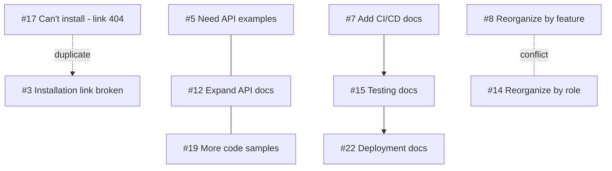

# Task 3.2: Identify Relationships and Duplicates

**Duration:** 10 minutes
**Difficulty:** Intermediate

## Objective

Find connections between issues to identify duplicates, related items, conflicts, and dependencies that should inform your work plan.

## Context

Issues don't exist in isolation. Some are duplicates, some are related and should be worked on together, some conflict with each other, and some depend on others being completed first.

Identifying these relationships helps you:
- Consolidate duplicate work
- Plan efficient batches
- Avoid conflicting changes
- Sequence dependent work correctly

## Your Challenge

Create a relationship map showing how issues connect to each other.

## Tasks

### 1. Find Duplicate Issues

**Example AI Prompt:**
```
Review these 25 issues and find duplicates:

[Paste all issue titles and descriptions]

Identify:
1. Exact duplicates (same problem, different words)
2. Partial duplicates (overlapping problems)
3. Related but distinct (similar topic, different issue)

For each duplicate pair/group, explain:
- Which issue should be kept (most detailed or earliest)
- Which should be closed
- Response to use when closing
```

**Deliverable:** Create `issue-relationships.md` with "Duplicates" section

### 2. Group Related Issues

**Example AI Prompt:**
```
From these categorized issues:

[Paste issue list]

Identify groups of related issues that should be worked on together:

For example:
- Multiple issues about the same documentation section
- Issues requiring similar changes
- Issues that would benefit from coordinated fixes

Create "issue groups" with:
- Group name
- Issues included (#1, #5, #12)
- Why they're related
- Suggested approach to address as a batch
```

**Deliverable:** Add "Related Issue Groups" section

### 3. Identify Conflicts

**Example AI Prompt:**
```
From this issue list:

[Paste issues]

Identify any conflicting requests:

Examples:
- Issue #X wants feature A, Issue #Y wants the opposite
- Issue #X requests change that would break Issue #Y's use case
- Two different solutions proposed for same problem

For each conflict:
- Issues involved
- Nature of conflict
- How to resolve (choose one, find compromise, etc.)
```

**Deliverable:** Add "Conflicting Issues" section

### 4. Map Dependencies

**Example AI Prompt:**
```
From these issues:

[Paste issues]

Identify dependencies:

- Issue #A blocks Issue #B (must be done first)
- Issue #A and #B depend on same infrastructure change
- Issue #A requires decision on #B

Create a dependency map showing:
- Blocking issues (must do first)
- Dependent issues (can't do until blocker resolved)
- Shared dependencies (need common foundation)
```

**Deliverable:** Add "Dependencies" section

### 5. Create Visual Relationship Map

**Example AI Prompt:**
```
Based on the relationships identified:

Duplicates: [list]
Related groups: [list]
Conflicts: [list]
Dependencies: [list]

Create a visual representation using:
- Mermaid diagram syntax, OR
- ASCII art, OR
- Structured outline

Show:
- Issue clusters (related groups)
- Duplicate pairs (which to close)
- Dependencies (arrows showing must-do-first)
- Conflicts (needs decision)
```

**Deliverable:** Add "Visual Map" section

## Output Format

```markdown
# Issue Relationship Analysis

**Date:** [Date]
**Total Issues:** 25
**Relationships Found:** [Count]

---

## Duplicates

### Duplicate Group 1: Installation Problems
- **Keep:** Issue #3 (most detailed, earliest report)
- **Close:** Issue #17 (duplicate)
- **Relationship:** Both report broken installation link
- **Closing Response:**
  > "Thanks for reporting! This is a duplicate of #3 which we're tracking. See [link] for updates."

### Duplicate Group 2: [Name]
...

**Total Duplicates:** X issues can be closed

---

## Related Issue Groups

### Group 1: API Documentation Expansion
**Issues:** #5, #12, #19
**Relationship:** All request more API examples
**Combined Scope:** Add comprehensive API examples section
**Approach:** Create single PR addressing all three
**Estimated Effort:** 6h (vs 8h if done separately)
**Priority:** High

### Group 2: [Name]
...

**Total Groups:** X groups covering Y issues

---

## Conflicting Issues

### Conflict 1: Documentation Structure
**Issues Involved:**
- Issue #8: Request to reorganize by feature
- Issue #14: Request to reorganize by user role

**Nature of Conflict:** Mutually exclusive organization schemes

**Resolution Strategy:**
- Gather more user feedback
- Consider both in navigation redesign
- Possibly support both via multiple entry points
- Need product decision

**Action:** Label both as `needs-decision`, start discussion

### Conflict 2: [Name]
...

---

## Dependencies

### Dependency Chain 1
```
Issue #7 (Add CI/CD docs)
    ↓ blocks
Issue #15 (Document automated testing)
    ↓ blocks
Issue #22 (Add deployment automation docs)
```

**Implication:** Must do #7 → #15 → #22 in sequence

**Timeline:** Week 3 → Week 4 → Week 5

### Dependency Chain 2
...

### Shared Dependencies

**Common Requirement:** Navigation restructure
**Blocked Issues:** #8, #11, #14, #20
**Blocker:** Need to implement new nav system first
**Action:** Add "Navigation redesign" as prerequisite task

---

## Visual Relationship Map



---

## Key Insights

### Efficiency Opportunities
1. **Batch related issues:** Addressing groups together saves X hours
2. **Close duplicates early:** Removes X issues from backlog immediately
3. **Resolve conflicts first:** Unblocks X other issues

### Sequencing Requirements
1. Must complete navigation redesign before #8, #11, #14, #20
2. API work (#5, #12, #19) can be done together
3. Dependency chain #7 → #15 → #22 requires 3 weeks

### Decision Needed
1. **Conflict between #8 and #14:** Need product input
2. **Scope question for #11:** Clarify before starting

---

## Impact on Action Plan

### Adjust Priorities
- Do #3 soon (affects duplicate #17 too)
- Batch #5, #12, #19 in same sprint
- Delay #15 and #22 until #7 complete

### Close Early Wins
- Immediately close #17 as duplicate
- [Other duplicates...]

### Add Prerequisite Tasks
- [ ] Navigation redesign (blocks 4 issues)
- [ ] API examples infrastructure (needed for group work)

---

*Update action-plan.md based on these relationships*
```

## Success Criteria

- ✅ Identified all duplicate issues (at least 2)
- ✅ Grouped related issues into logical batches
- ✅ Found any conflicting requests
- ✅ Mapped dependencies between issues
- ✅ Created visual representation
- ✅ Provided actionable insights

## Hints

<details>
<summary>Hint 1: Look for Similar Keywords</summary>

Duplicates often use similar language. Search for:
- Same feature names
- Same error messages
- Same doc sections mentioned
- Similar pain points described
</details>

<details>
<summary>Hint 2: Group by Doc Section</summary>

Issues affecting the same documentation section are often related and should be addressed together.
</details>

<details>
<summary>Hint 3: Dependencies Flow Chart</summary>

Draw a simple flow: Foundation → Mid-level → Advanced

Issues building on others should be sequenced accordingly.
</details>

## Time Management

- **Minutes 0-3:** Find duplicates
- **Minutes 4-6:** Group related issues
- **Minutes 7-8:** Identify conflicts
- **Minutes 9-10:** Map dependencies and create visual

## What's Next?

Move to **Task 3.3** to create issue templates and processes that prevent future backlog problems.

---

**Need the solution?** Check [solutions/solution-3.2-relationships.md](../solutions/solution-3.2-relationships.md)
